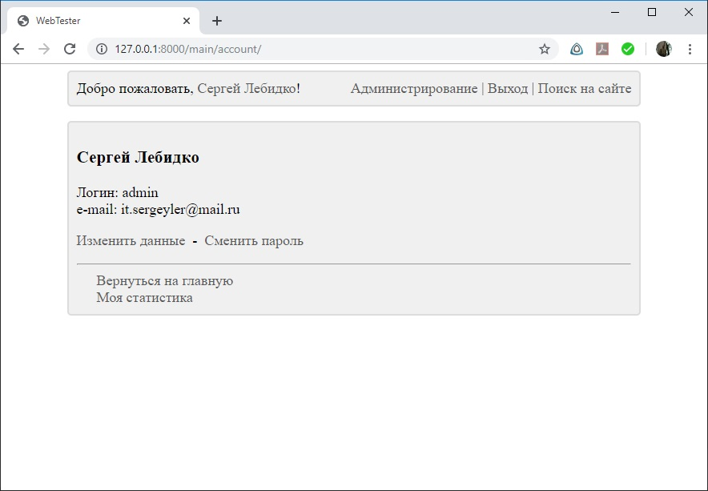

# WebTester
Сервис для тестирования

Небольшой сервис для тестирования созданный с использованием фреймворка Django. Зарегистрированные пользователи могут проходить тесты, сгруппированные по различным категориям. Статистика пользователей (дата и время прохождения тестов, количество правильных и неправильных ответов) сохраняется и доступна им для просмотра. Управление тестами и их группами (добавление/удаление/редактирование самих тестов, вопросов, вариантов ответов) осуществляется суперпользователем через стандартную консоль администрирования Django.
Реализован поиск по сайту.

Для разработки использовалась версия Django 2.2.7

Суперпользователь: 
 - логин: admin
 - пароль: Xy159753
 
 Для запуска на локальной машине из под тестового сервера Django нужно набрать в адресной строке: http://127.0.0.1:8000/main/

Скриншоты проекта приведены ниже:

